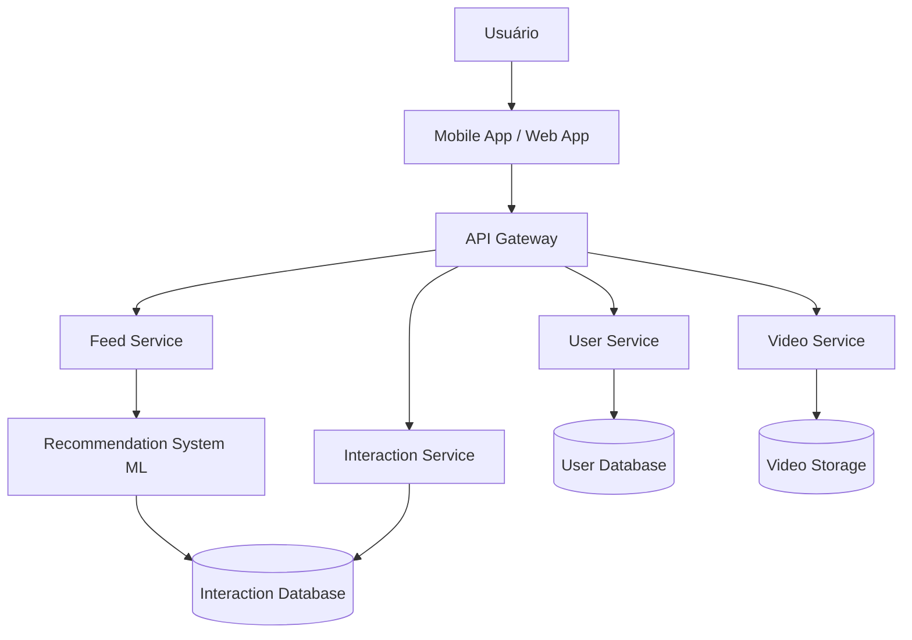

# Arquitetura Atual (Simplificada)

```mermaid
graph TD

User[Usuário]
App[Mobile App / Web App]

APIGateway[API Gateway]

FeedService[Feed Service]
UserService[User Service]
VideoService[Video Service]
InteractionService[Interaction Service]

RecommendationML[Recommendation System ML]

UserDB[(User Database)]
VideoStorage[(Video Storage)]
InteractionDB[(Interaction Database)]

User --> App
App --> APIGateway

APIGateway --> FeedService
APIGateway --> UserService
APIGateway --> VideoService
APIGateway --> InteractionService

FeedService --> RecommendationML

RecommendationML --> InteractionDB

UserService --> UserDB
VideoService --> VideoStorage
InteractionService --> InteractionDB
```